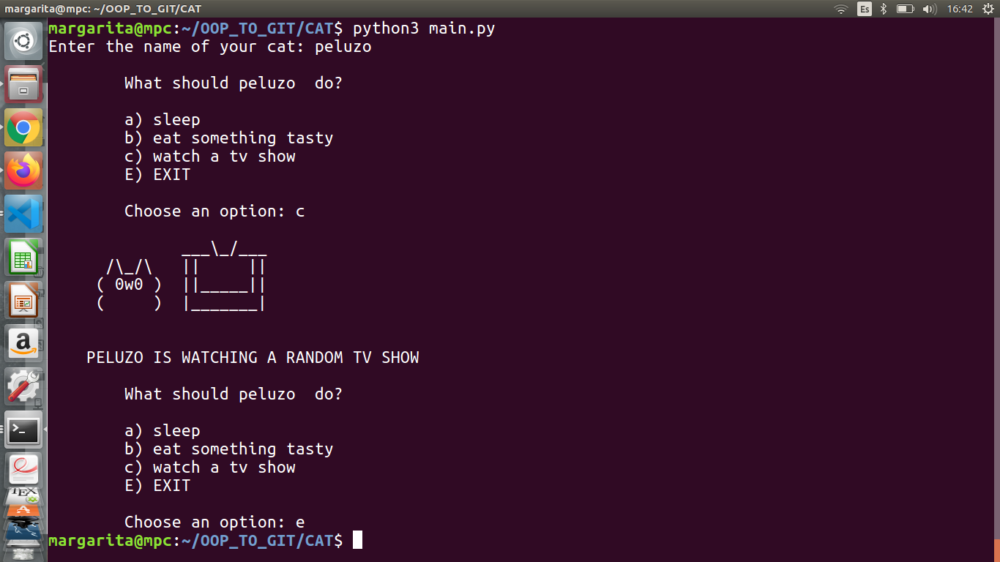

# Coding with OOP and Python
I'm still working in this, maybe is gonna be a brief but good OOP and Python overview because this examples has 
representative OOP applications.
I like cats so you are gonna see many of them here. The following are some of the codes of this repository:

**1. CATS**

A Cat class is used to create a pet for the user and the methods of this class are used to display ASCII art displaying
a cute cat doing funny stuff:

**2. CATS_BOOK**

This is code store Cat objects inside a object list and uses some of the principal functions for **create, read, update and
delete elements** (cat objects) **inside the list.**

**3. CATS_STORAGE**

This program is alike the last one but store cats in a **csv** file. Csv or comma separated values, is a way to create tables
with columns separated by comma. 

Still working in the other files...

